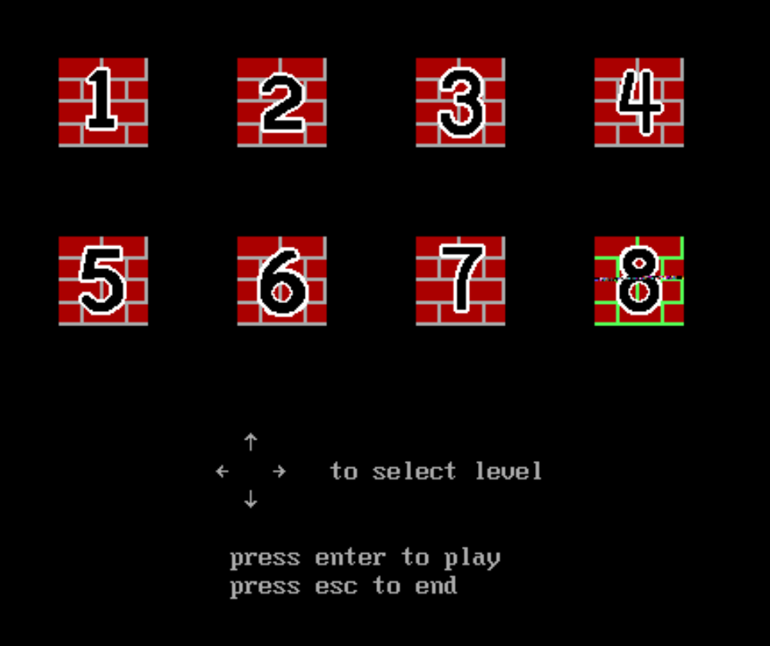
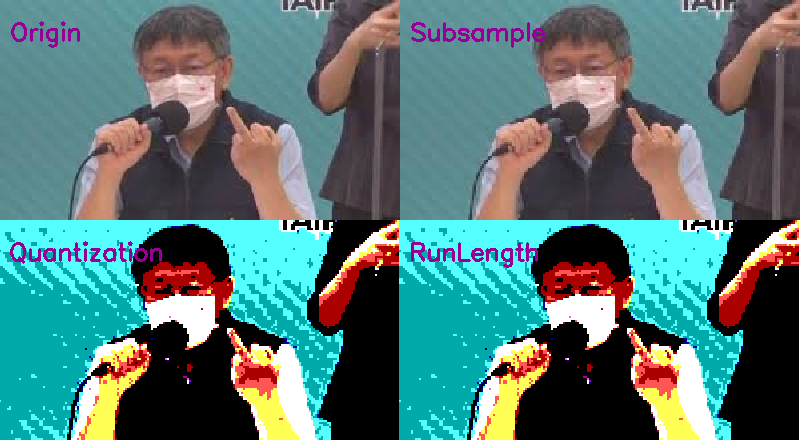
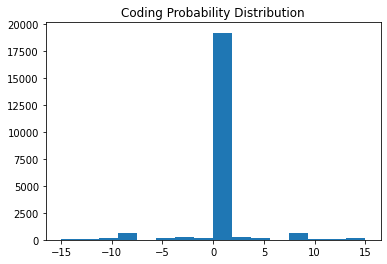
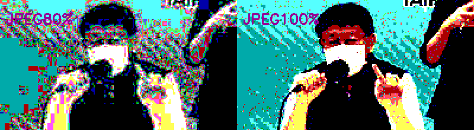

# Sokoban by 8086

 👇 youtube link<br>
<kbd><a href="https://www.youtube.com/watch?v=6fKehSFpv5g"></a></kbd><br> 

Code：<a href='v2_7mo/v2_7mo.asm'>Here</a>

# masm資料容量限制

因為本程式使用MASM(Microsoft Macro Assembler)組合語言，在smal model下資料總長度不能超過64KB<br>
<a href='https://books.google.com.tw/books?id=PhJRrlxoczMC&pg=PA129&lpg=PA129&dq=%E5%9F%B7%E8%A1%8C%E6%AA%94%E6%9C%80%E5%A4%A764KB%E7%84%A1%E6%B3%95%E5%9F%B7%E8%A1%8C&source=bl&ots=5pgt6LUs1M&sig=ACfU3U3F-JvcqfdIanJ6L1_FFPi4kOnCbg&hl=zh-TW&sa=X&ved=2ahUKEwiWydDL4fv1AhUGVpQKHbALDGQQ6AF6BAgTEAI#v=onepage&q=%E5%9F%B7%E8%A1%8C%E6%AA%94%E6%9C%80%E5%A4%A764KB%E7%84%A1%E6%B3%95%E5%9F%B7%E8%A1%8C&f=false'>(規定)</a>
，所以在第一版執行時發現當資料大小超出一點時，資料的結尾會發生毀損，如下圖，關卡八按鈕圖案毀損，因此檔案必需經過壓縮，而組合語言相較其他語言無法簡單的找到對應的函式庫，所以選擇的壓縮方式會以兼具易於撰寫及壓縮比來做選擇。
<br>
依上述需求實作了三種壓縮方法：
- Huffman Coding
- Huffman Code by Differential Coding
- Run Length Coing<br>
最後選擇Run Length Coing做壓縮，並與比較現有的壓縮檔案如PNG、JPEG等比較壓縮比。<br>
#
8086的常用顯示模式(AL=12h,INT 10h)為長寬640 * 480像素、16色，可顯示顏色如下圖，<br>
<br>
所以原本的圖須經過subsampling & quantization再壓縮。
<br>

# Huffman Coding
Huffman Code的編碼方式為：出現頻率較高的字元，使用長度較短的編碼；反之，出現頻率較低者，使用長度較長的編碼，整體平均後可以得到較小的編碼長度。
並且須建立huffman tree作為codebook。<br>
<br>
因為在組合語言實作tree太過困難，所以將其轉成矩陣儲存，演算法如下：<br>
由B12向下尋找子節點，並將子節點紀錄在矩陣上<br>
<br>
如果該節點為分支，則改成紀錄離左邊的支點需要位移多少<br>
如果該節點為端點，代表此節點有編碼<br>
<br>
將再編碼成二進制(是分支或是端點需多一位元紀錄)<br>
<br>
程式如下：
```python
def get_codebook_node():
  codebook_node = [code2node('')] 
  while(any('B' in code for code in codebook_node)):
    for i in range(len(codebook_node)):
      if 'B' in codebook_node[i]:
        shift = len(codebook_node) - i
        code_tmp = node2code(codebook_node[i])
        codebook_node[i] = 'S'+str(shift)
        codebook_node.append(code2node(code_tmp+'0'))
        codebook_node.append(code2node(code_tmp+'1'))
  return codebook_node[1:]

def code2node(code):
  for node in huff_tree:
    if huff_tree[node]['code']==code:
      return node
def node2code(node):
  return huff_tree[node]['code']
```
等真正的碼進來時便可今由上面的方式解碼，如果落到的位置為分支，則位移後再取下一碼，直到落到的是端點，由此重複。<br>
<br>
並將資料轉成組合語言格式。<br>

# Huffman Code by Differential Coding
Differential Coding 的編碼方式為記錄某一點資料與前一點資料的差值，
如果某一點資料與前一點資料相同，便會記錄成0，此方法紀錄圖案會大大增加資料為0的佔比，而機率越不平均壓縮效果越好，由此改進壓縮效果。<br>

以CoP這張照片為例，可以看到0佔所有資料遠超過其他數值，如果再加上tunstall code(將多筆資料一起編碼)壓縮結果會更好<br>
<br>
Demo程式：<a href='https://colab.research.google.com/github/majaja068/Assembly_Sokoban/blob/v2022/supplement/Sokoban_HuffmanCoding.ipynb'>Sokoban_HuffmanCoding.ipynb</a>

# Run Length Coding
Run Length Coding 是將連續相同顏色合併，並記錄哪個顏色出現幾次做壓縮。<br>
既不需用Codebook，解碼也較簡單，再加上壓縮比剛好也是最好的，所以最後選用此方式。<br>
<br>
而因為本程式顯示模式為16色，所以每一byte中會多出4bits，所以此4bits可記錄出現幾次相同顏色(超出16個相同會切斷)。<br>
Demo程式：<a href='https://colab.research.google.com/github/majaja068/Assembly_Sokoban/blob/v2022/supplement/Sokoban_RunLengthCoding.ipynb'>Sokoban_RunLengthCoding.ipynb</a>
#
下列表為前三種方法的壓縮比比較:
Method              | CoP | Fish | Veg
--------------------|:---:|:----:|-----
Huffman Cod         |3.212|3.716 |3.950
Differential Huffman|5.213|4.583 |5.276
Run Leength Code    |6.197|5.057 |6.548

# Transparent Color
如遇到因背景不同需切換顏色的狀況，在本程式設定了所有圖片都沒出現的'7'作為透明色，透明色可依```transparnt_color```變數的不同做顏色調整，在磚頭的選擇以及人物上使用到。<br>
masm繪製程式如下：
```asm
PrintPicture proc near     
    ;========calculate_x/y_end========
    _mov pic_x_end,pic_amp
    _mul pic_x_end,pic_x_range
    _add pic_x_end,pic_x_start
    _mov pic_y_end,pic_amp
    _mul pic_y_end,pic_y_range
    _add pic_y_end,pic_y_start      
    ;====end=setting========
    mov cx,pic_x_start
    mov dx,pic_y_start   
pic_next_byte:    
    mov al,[bp]
    mov pic_r_count,al
    shr pic_r_count,1 
    shr pic_r_count,1 
    shr pic_r_count,1 
    shr pic_r_count,1    
    and al,0fh
    cmp al,7
    jne pic_repeat
    mov al,pic_transparent_color
pic_repeat:   
    ;;;=====print====
    call WrPixelAmp
    add cx,pic_amp
    cmp cx,pic_x_end
    jnz pic_skip_change_line
    mov cx,pic_x_start
    add dx,pic_amp
pic_skip_change_line:    
    ;;;====end print=====
    dec pic_r_count
    cmp pic_r_count,0
    jnz pic_repeat
    inc bp
    cmp dx,pic_y_end
    jnz pic_next_byte
ret
PrintPicture endp
```


# 與現有壓縮檔案比較
TIF檔為早期印表機匯出的點陣圖格式，可選擇以不同方式壓縮。<br>
而這些方式有對應的檔案格式，例如PNG檔以Deflate方式壓縮、GIF以LZW方式壓縮...。<br>
而CCITT是針對而為圖像的延伸壓縮方式，以Run Lenhth Coding編碼第一行，用Pass Mode、Horizontal Mode、Veritical Mode紀錄與上一行的差異。<br>
在BMP檔案，因為沒有壓縮，所以以0 ~ 15編碼儲存，就約等於是以灰階儲存，檔案會節省至1/3，所以公平起見全部檔案都是以編碼資料儲存。<br>

檔案大小<br>
Algorithm |  CoP  | Fish  |  Veg  |File Format|  CoP  | Fish  |  Veg 
----------|:-----:|:-----:|:-----:|-----------|:-----:|:-----:|-------
None      |22,134B|22,134B|22,134B|BMP        |23,078B|23,078B|23,078B
Deflate   | 2,712B| 3,144B| 2,474B|PNG        | 3,191B| 3,883B| 3,168B
LZW       | 3,420B| 4,102B| 3,152B|GIF        |10,035B|10,771B| 8,952B
CCITT_T6  |    X B|    X B|    X B|TIF_CCITT  | 4,762B| 4,214B| 4,408B
JPEG      | 1,641B| 1,675B| 1,549B|JPEG(80%)  | 1,706B| 1,744B| 1,577B
--        |       |       |       |JPEG(100%) | 7,634B| 7,859B| 6,572B

壓縮比<br>
Algorithm | CoP |Fish | Veg |File Format| CoP |Fish | Veg 
----------|:---:|:---:|:---:|-----------|:---:|:---:|-----
None      |1.000|1.000|1.000|BMP        |1.000|1.000|1.000  
Deflate   |8.162|7.040|8.947|PNG        |7.232|5.933|7.285  
LZW       |6.472|5.396|7.022|GIF        |2.300|2.143|2.578
CCITT_T6  |   X |   X |   X |TIF_CCITT  |4.846|5.477|5.235
JPEG      |13.49|13.21|14.29|JPEG(80%)  |13.53|13.23|14.63
--        |     |     |     |JPEG(100%) |3.023|2.937|3.512

以編碼(0 ~ 15)壓縮，因為JPEG無論如何會消除一些低頻，如果是灰階或全彩不會看出差異,<br>
但編碼順序是沒有邏輯的，所以解壓縮回去看起來失真非常多。<br>
<br>
以全彩壓縮便看不出差異<br>
<br>

Demo程式：<a href='https://colab.research.google.com/github/majaja068/Assembly_Sokoban/blob/v2022/supplement/Sokoban_FileFormat.ipynb'>Sokoban_FileFormat.ipynb</a>