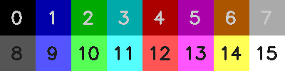
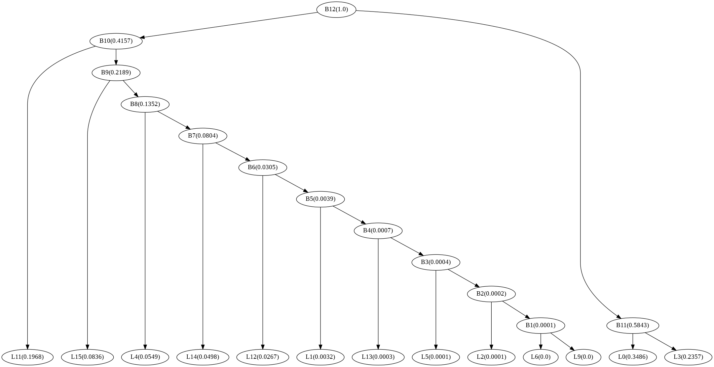
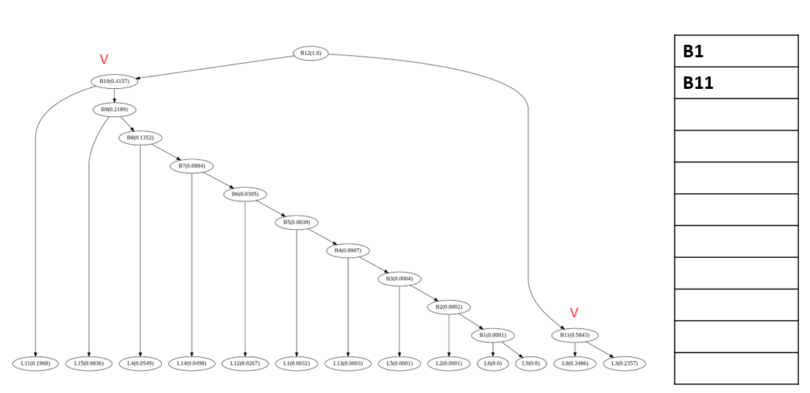
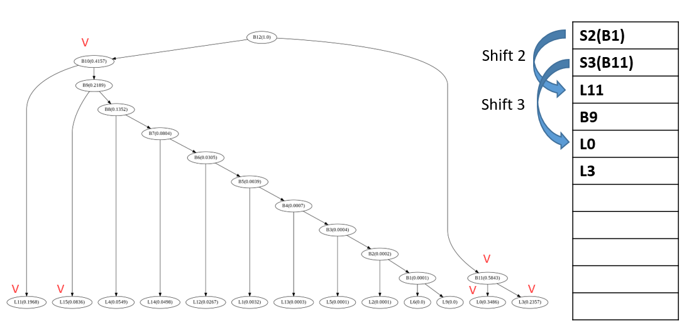
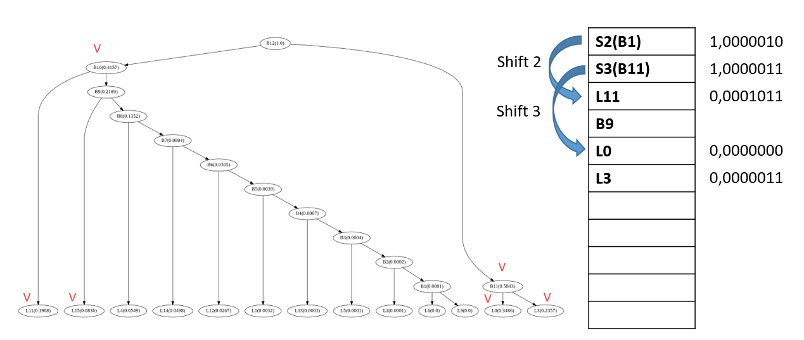
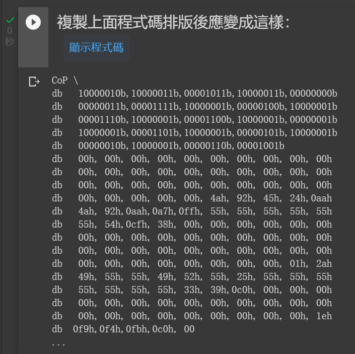

# Sokoban by 8086

 👇 youtube link<br>

<kbd><a href="https://www.youtube.com/watch?v=6fKehSFpv5g"></a></kbd><br> 


# masm資料容量限制

因為本程式使用MASM(Microsoft Macro Assembler)組合語言，在smal model下資料總長度不能超過64KB

，所以在第一版執行時發現當資料大小超出一點時，資料的結尾會發生毀損，如下圖，關卡八按鈕圖案毀損，因此檔案必需經過壓縮，而組合語言相較其他語言無法簡單的找到對應的函式庫，所以選擇的壓縮方式會以兼具易於撰寫及壓縮比來做選擇。

依上述需求實作了三種壓縮方法：
- Huffman Coding
- Huffman Code by Differential Coding
- Run Length Coing
最後選擇Run Length Coing做壓縮，並與比較現有的壓縮檔案如PNG、JPEG等比較壓縮比

#
8086的常用顯示模式(AL=12h,INT 10h)為長寬640 * 480像素、16色，可顯示顏色如下圖，

所以原本的圖須經過subsampling & quantization再壓縮。


# Huffman Coding
Huffman Code的編碼方式為：出現頻率較高的字元，使用長度較短的編碼；反之，出現頻率較低者，使用長度較長的編碼，整體平均後可以得到較小的編碼長度。
而須建立huffman tree作為codebook。

因為在組合語言實作tree太過困難，所以將其轉成矩陣儲存，演算法如下：
由B12向下尋找子節點，並將子節點紀錄在矩陣上

如果該節點為分支，則改成紀錄離左邊的支點需要位移多少
如果該節點為端點，代表此節點有編碼

將再編碼成二進制(是分支或是端點需多一位元紀錄)

程式如下：
```python
def get_codebook_node():
  codebook_node = [code2node('')] 
  while(any('B' in code for code in codebook_node)):
    for i in range(len(codebook_node)):
      if 'B' in codebook_node[i]:
        shift = len(codebook_node) - i
        code_tmp = node2code(codebook_node[i])
        codebook_node[i] = 'S'+str(shift)
        codebook_node.append(code2node(code_tmp+'0'))
        codebook_node.append(code2node(code_tmp+'1'))
  return codebook_node[1:]

def code2node(code):
  for node in huff_tree:
    if huff_tree[node]['code']==code:
      return node
def node2code(node):
  return huff_tree[node]['code']
```
等真正的碼進來時便可今由上面的方式解碼，如果落到的位置為分支，則位移後再取下一碼，直到落到的是端點，由此重複。

並將資料轉成組合語言格式。


# Huffman Code by Differential Coding
Differential Coding 的編碼方式為記錄某一點資料與前一點資料的差值，
如果某一點資料與前一點資料相同，便會記錄成0，此方法紀錄圖案會大大增加資料為0的佔比，而機率越不平均壓縮效果越好，由此改進壓縮效果。

以CoP這張照片為例，可以看到0佔所有資料遠超過其他數值，如果再加上tunstall code(將多筆資料一起編碼)壓縮結果會更好

# Run Length Coing


# 與現有壓縮檔案比較